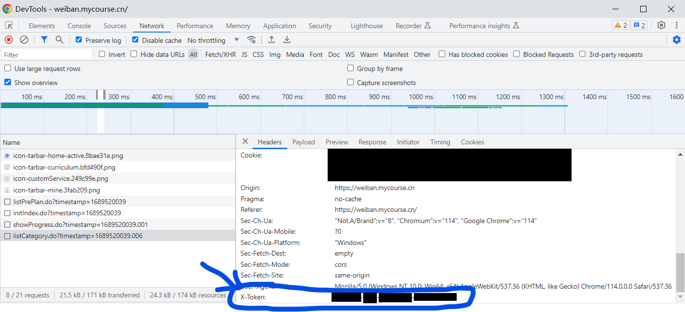
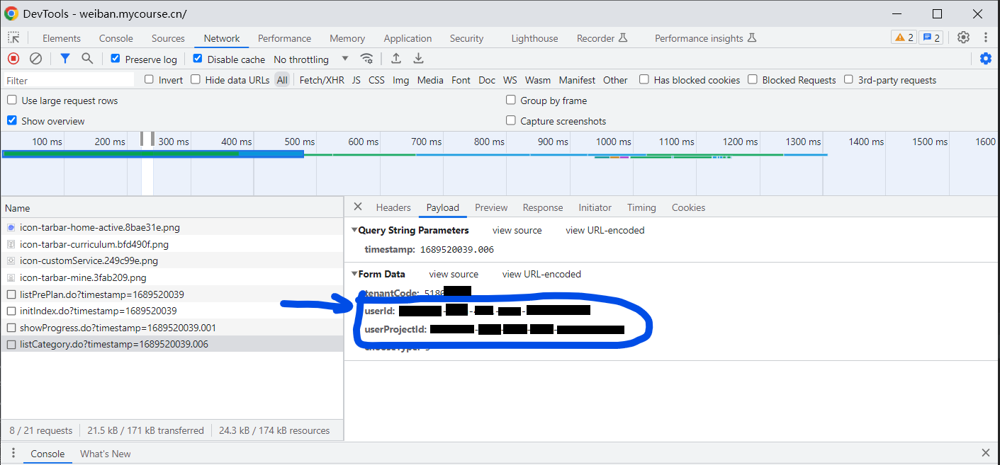

# WEIBAN Course Master

## 免责声明

安全牢记在心，幸福常伴左右

免责声明

在使用脚本之前，请您仔细阅读以下声明。通过使用脚本，即表示您同意本免责声明中的条款和条件。如果您不同意这些条款和条件，请不要使用该脚本。

1. 本脚本仅用于教育和研究目的。刷课脚本的目的是帮助用户自动化完成在线课程的学习进程，提高效率和便利性。

2. 使用脚本的风险完全由用户自行承担。脚本作者及相关机构或个人对于因使用该脚本导致的任何直接或间接损失或损害，包括但不限于学业问题、账号封禁、法律责任等，概不负责。

3. 本人已通过其他方式学习了有关安全知识，并成功完成了相关的安全测试。换而言之，在使用刷课脚本之前，我已了解和掌握了必要的安全意识和防护措施。

4. 脚本的使用可能违反在线课程平台的使用条款和条件。用户在使用脚本之前应仔细阅读并遵守相关平台的规定。用户因违反平台规定而导致的后果，本脚本作者及相关机构或个人概不负责。

5. 作者提醒使用者自主学习安全知识并增强网络安全意识。请用户理解和认识到安全知识的重要性，以免受到潜在的风险和威胁。

6. 作者及相关机构或个人不对脚本的性能、稳定性或适用性作出任何明示或暗示的保证。脚本可能会受到在线课程平台的更改、更新或维护等因素的影响，导致脚本无法正常工作。

7. 用户在使用脚本时应遵守法律法规和道德规范。不得将脚本用于任何非法活动或侵犯他人权益的行为。用户因违反法律法规或道德规范而导致的责任，与本脚本作者及相关机构或个人无关。

通过使用本脚本，即表示您已阅读、理解并同意接受上述免责声明中的条款和条件。如您不同意此声明，请立即停止使用该脚本。

## 使用

在脚本相同目录下创建一个名为`config.py`的文件，登录安全教育学习页面，并在浏览器开发工具中找到下文中提及的三个token：

```python
TOKEN = 'xxxxxxxx-xxxx-xxxx-xxxx-xxxxxxxxxxxx'
USERID = 'xxxxxxxx-xxxx-xxxx-xxxx-xxxxxxxxxxxx'
USERPROJECTCODE = 'xxxxxxxx-xxxx-xxxx-xxxx-xxxxxxxxxxxx'
```





运行`main.py`即可开始学习课程。

## Appendix

> https://weiban.mycourse.cn/pharos/project/showProgress.do 获取学习课程的进展
> https://weiban.mycourse.cn/pharos/usercourse/listCategory.do 获取所有的类别
> https://weiban.mycourse.cn/pharos/usercourse/listCourse.do 根据给出的类别获取所有的课程
> https://weiban.mycourse.cn/pharos/usercourse/study.do 向这个网址发送一个post请求，表示学习的开始
> https://weiban.mycourse.cn/pharos/usercourse/getCourseUrl.do 通过这个url可以获取`methodToken`
> https://weiban.mycourse.cn/pharos/usercourse/v1/methodToken.do 完成学习，关键参数：`callback`和`_`

```python
# 完整代码
import time
from urllib import request, parse
import http
import json
import random
import datetime
import os
import config


__X_token = config.TOKEN
__ua_headers = {'User-Agent': 'Mozilla/5.0 (Windows NT 10.0; Win64; x64) AppleWebKit/537.36 (KHTML, like Gecko) '
                              'Chrome/92.0.4515.107 Safari/537.36', 'X-Token': __X_token}
__debug = False
__disconnect_count = 0


# js里的时间戳似乎都是保留了三位小数的.
def __get_timestamp():
    return str(round(datetime.datetime.now().timestamp(), 3))


def __gen_url(raw_url):
    return raw_url + '?timestamp=' + __get_timestamp()


# Magic: 用于构造、拼接"完成学习任务"的url
# js: (jQuery-3.2.1.min.js)
# f = '3.4.1'
# expando = 'jQuery' + (f + Math.random()).replace(/\D/g, "")
def __gen_rand():
    return ('3.4.1' + str(random.random())).replace('.', '')


def __waiting(k=0):
    t = 100 * k + random.randint(0, 100)
    time.sleep(t / 100)


def process_url(URL, PARAM, METHOD='POST'):
    temp = None
    while not temp:
        temp = __process_url(URL, PARAM, METHOD)
    return temp


def __process_url(URL, PARAM, METHOD):
    if METHOD == 'POST':
        data = bytes(parse.urlencode(PARAM), encoding='utf-8')
        req = request.Request(url=__gen_url(URL), data=data, method=METHOD, headers=__ua_headers)
    elif METHOD == 'GET':
        URL += '?'
        # 拼接地址
        for key, item in PARAM.items():
            URL = URL + ('' if URL.endswith('?') else '&') + key + '=' + item
        ###################################
        # 学得太快有可能学不上, 需要等待一会.
        __waiting(15)
        ###################################
        req = request.Request(url=URL, method=METHOD, headers=__ua_headers)
        if __debug:
            print(URL)
    else:
        raise ValueError('Wrong Method!')
    try:
        responseStream = request.urlopen(req)
    except http.client.RemoteDisconnected:
        return None
    responseText = responseStream.read().decode('utf-8')
    try:
        # finish学习返回的东西解不了码, 但是里面的内容不重要.
        responseJSON = json.loads(responseText)
    except json.decoder.JSONDecodeError:
        if __debug:
            print(responseText)
        return 1
    if __debug:
        print(responseJSON)
    __waiting()
    return responseJSON


def main():
    tenantCode = '51800002'
    userId = config.USERID
    userProjectId = config.USERPROJECTCODE

    if __debug:
        # step1: show progress
        url = 'https://weiban.mycourse.cn/pharos/project/showProgress.do'
        param = {
            'userProjectId': userProjectId,
            'userId': userId,
            'tenantCode': tenantCode,
        }
        progressInfo = process_url(url, param)
        print('总课程数: {}, 已完成课程数: {}.'
              .format(progressInfo['data']['requiredNum'], progressInfo['data']['requiredFinishedNum']))

    if os.path.exists('./course.json') and False:
        print('从本地获取课程信息......')
        with open('./course.json', 'r') as f:
            courseInfo = json.load(f)['data']
    else:
        # step2: list category
        url = 'https://weiban.mycourse.cn/pharos/usercourse/listCategory.do'
        param = {
            'userProjectId': userProjectId,
            'userId': userId,
            'tenantCode': tenantCode,
            'chooseType': 3,
        }
        categoryInfoRaw = process_url(url, param)
        categoryInfo = []
        for category in categoryInfoRaw['data']:
            categoryInfo.append(
                (category['categoryCode'], category['categoryName'], category['totalNum'], category['finishedNum']))
            if __debug:
                print('类别: {}, 总数: {}, 已完成 {}.'
                      .format(category['categoryName'], category['totalNum'], category['finishedNum']))
        del categoryInfoRaw

        # step3: get all course
        url = 'https://weiban.mycourse.cn/pharos/usercourse/listCourse.do'
        courseInfo = []
        for category in categoryInfo:
            param = {
                'userProjectId': userProjectId,
                'userId': userId,
                'tenantCode': tenantCode,
                'chooseType': 3,
                'categoryCode': category[0]
            }
            courseInfoRaw = process_url(url, param)
            for course in courseInfoRaw['data']:
                courseInfo.append(
                    (course['userCourseId'], course['resourceId'], course['resourceName'], course['finished']))
        with open('./course.json', 'w') as f:
            json.dump({'data': courseInfo}, f)
    # 找到所有的课程.
    print('课程总数:', len(courseInfo))

    study_url = 'https://weiban.mycourse.cn/pharos/usercourse/study.do'
    get_url_url = 'https://weiban.mycourse.cn/pharos/usercourse/getCourseUrl.do'
    finish_url = 'https://weiban.mycourse.cn/pharos/usercourse/v1/{}.do'
    for course in courseInfo:
        print('课程名: {}, 完成情况: {}'.format(course[2], '已完成' if course[3] == 1 else '未完成'))
        if course[3] == 1:
            # 跳过已完成的课程.
            continue
        else:
            # step4: do study
            param = {
                'userProjectId': userProjectId,
                'userId': userId,
                'tenantCode': tenantCode,
                'courseId': course[1]
            }
            process_url(study_url, param)
            urlInfoRaw = process_url(get_url_url, param)
            # getCourseUrl.do 的请求将会返回一个url, 这个url中包含有一个参数methodToken, token将会是finishCourse请求的一部分.
            index_s = urlInfoRaw['data'].find('methodToken') + 12
            index_e = urlInfoRaw['data'].find('&', index_s)
            methodToken = urlInfoRaw['data'][index_s: index_e]
            if __debug:
                print(methodToken)
            temp_url = finish_url.format(methodToken)
            ts = __get_timestamp().replace('.', '')
            # 请求包含一个时间戳, 这个时间戳分别被用在callback参数和_参数上, 后者需要自增1.
            param = {
                'callback': 'jQuery{}_{}'.format(__gen_rand(), ts),
                'userCourseId': course[0],
                'tenantCode': tenantCode,
                '_': str(int(ts) + 1),
            }
            process_url(temp_url, param, 'GET')


if __name__ == '__main__':
    main()
```

